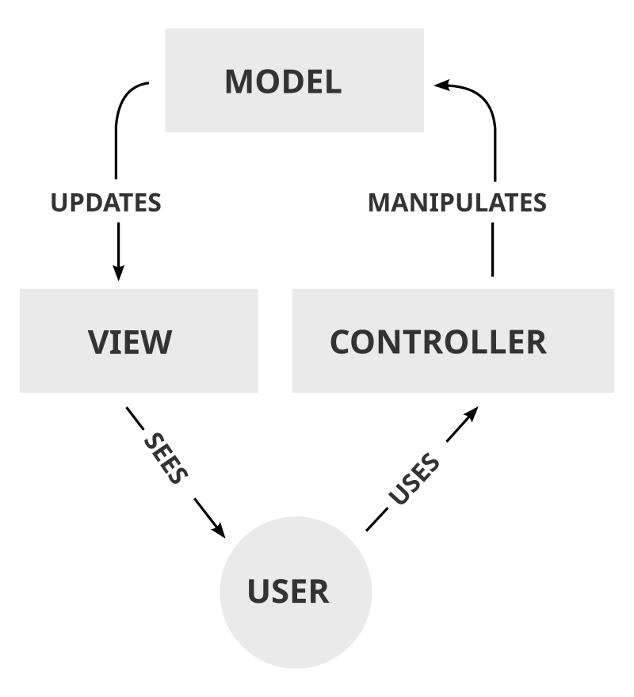

# The MVC (Model View Controller) Design Pattern

We use the [MVC (Model View Controller)](https://en.wikipedia.org/wiki/Model%E2%80%93view%E2%80%93controller)
design pattern often in games it provides the following benefits:
* The code is easier to extend and edit 
* The code is clearer to the reader 
* It's easier to abide by SOLID principles (Mainly Single Responsibility)

The idea, is to isolate the functionalities running the core game cycles. 
Keep things restricted to "Model", "View" or "Controller"
and enforce how they communicate to each other.

# Example

Below is a diagram of the process, the main idea is:

(In the context of Chicken Chaser)

The __User__ talks to [PlayerControl.cs](../../Assets/Scripts/Managers/PlayerControls.cs) which is our controller
The __Player Controls__ talk to [PlayerChicken.cs](../../Assets/Scripts/Characters/Chicken/PlayerChicken.cs) which is our model
The __Player Chicken__ talks to the [HudManager.cs](../../Assets/Scripts/Managers/HudManager.cs) which is our view that the user sees.
