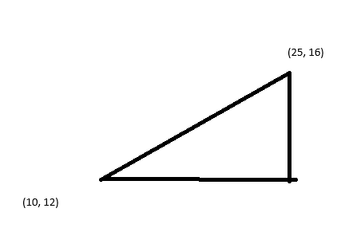
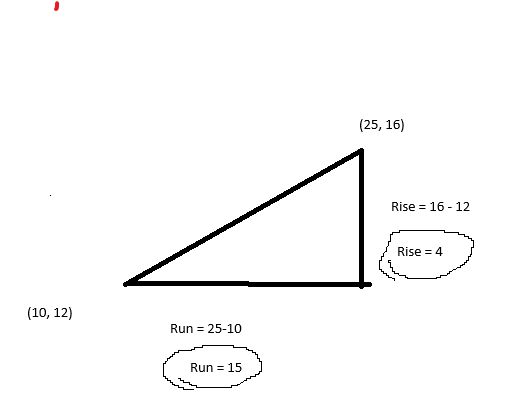

# Distance

## Slope

[Wikipedia](https://en.wikipedia.org/wiki/Slope)

### m = rise / run

Where m is the slope, rise is the change up/down and run is the change left/right.

To begin, our first step is very similar to what we do in 

[Distance.md](Distance.md)

We start by creating a line between two points by subtracting them

We can then say:

run = x2-x1
rise = y2-y1

NOTE: a common mistake is to subtract the points incorrectly.
To prevent this, make sure you subtract X from X and Y from Y starting at the same point and ending at the same point.
We generally say B - A.

Run = 15
Rise = 4

m (slope) = 4 / 15
**m = 0.266666667**

## Equation of the line

### y = mx + b

In this case, everything is a variable and it requires us to do some algebra to solve every aspect.
Usually, we know an X and Y because we know where our points are located. It does not matter which point we choose, but we must use both it's X and Y in the next step:

x = 25
y = 16
m = 0.266666667

From here we, let's start by filling in our variables:

16 = 25 * 0.266666667 + b

When we begin coding, we won't be able to resolve numbers so we must use algebra to solve now. The objective is to isolate b so no other terms are next to it.
To do this, we can subtract b from both sides.

16 - b = 25 * 0.266666667 + b - b

b - b = 0. We know this because 5-5 or any number subtracted from itself is 0.

So let's reformat again:

16 - b = 25 * 0.266666667

Next, we need to move 16, let's subtract it from both sides.

16 - 16 - b = 25 * 0.266666667 - 16

and resolve:

-b = 25 * 0.266666667 - 16

lastly, we must multiply by -1 so that b is positive

-b * -1 = -1 * (25 * 0.266666667 - 16)

b = -1 * (25 * 0.266666667 - 16)

If we removed the numbers,

b = -1 * (x * m - y)

So finally:
**b = 9.33333332** 

Now that we have y=mx+b, this equation allows us to give any x and solve for the y. 
This is important, because we can track an objects X position and retrieve the correct expected y position if it was on that line.
if you want to add things like 2D lasers, or slopes EOTL is necessary. 

Below is an interactive example in desmos with the numbers we used. 

## View in Desmos[In Desmos](https://www.desmos.com/calculator/2a9uvr6r31)

