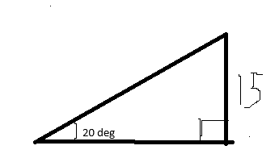
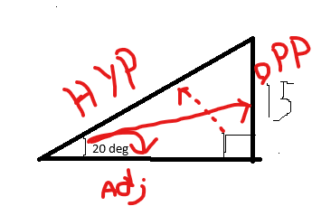

# SOHCAHTOA

## What is it?

SOH CAH TOA is an aspect of trigonometry essential to game development

SOH CAH TOA only works with RIGHT ANGLE triangles, meaning one angle must be 90 degrees.

SOH CAH TOA can tell us about the length of any side or degree of any angle given the other two variables, and is very powerful. In Game development SOH CAH TOA can be used for:
Firing towards an object, Teleporting / dashing towards (but not instantly) a point, or rotating to face an object. An excellent example of all of this is Bloons Tower Defense.

S = Sin
C = Cos
T = Tan

O = Opposite Side Length
A = Adjacent Side Length
H = Hypotenuse Side Length (Longest side, always opposite the 90 degree angle)

Formulae:

sin(angle (radians)) = opposite / hypotenuse

cos(angle (radians)) = adjacent / hypotenuse

tan(angle (radians)) = opposite / adjacent

[Wikipedia](https://en.wikipedia.org/wiki/Trigonometry)

## Example

Given an angle, and a side length find the hypotenuse:

Next, let's indicate what each side is and determine whether to use SOH, CAH or TOA

From this, we can now determine what information we know. Because we have an angle, we can use S, C or T. Next, we have a side. that side is O.

Given that we have S, C, T and O and need to solve for H which can we use? SOH CAH or TOA?

SOH. So let's solve:

sin(angle (radians)) = opposite / hypotenuse

First, we need to convert from degrees to radians:

angle (radians) = angle * π/180

angle (radians) = 0.349066

Next, let's isolate the hypotneuse by multiplying it onto each side

sin(angle) * hypotenuse = opposite

Then, we need to divide the sin(angle) from both sides

hypotenuse = opposite/sin(angle)

Finally put in our numbers

hypotenuse = 15 / sin(0.349066)

hypotenuse = 15 / 0.342020284

**hypotenuse = 43.857048**