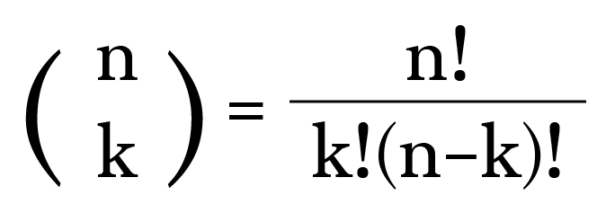
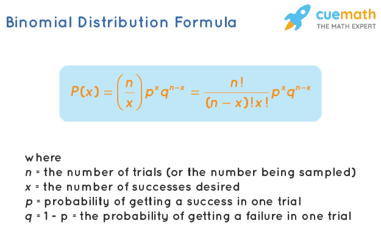
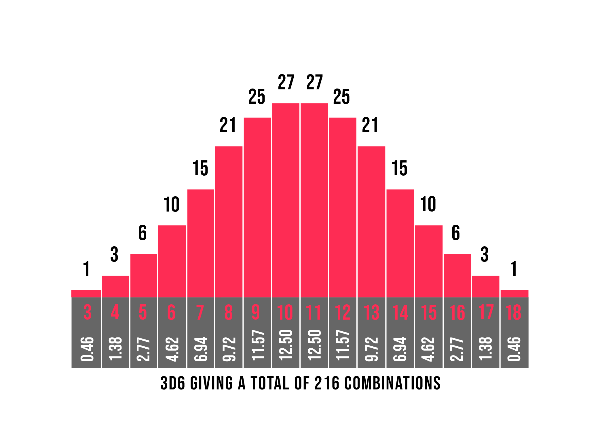

# Choose / Combination (Probability)

## What Is "Choose"?

[Wikipedia](https://en.wikipedia.org/wiki/Combination)

NOTE: before continuing make sure you understand [Factorial](../Factorial.md)

In probability and combinatorics, "choose" refers to the number of ways to select a subset of items from a larger set—without considering the order in which they are chosen. This is commonly represented by the binomial coefficient, written as:

In this formula. In this formula, n represent the total number of choices, and k represents the selected number of choices.

For example 4C2 is a common way to phrase this, where n is 4 and k is 2.

4C2 in english means, how many ways can we choose 2 items out of a set of 4?

## Examples

      4C2 = 4! / (2! * (4-2)!) 
      4C2 = 24 / (2 * 2)
      4C2 = 24 / 4
      4C2 = 6

Let's say we have 12 crayons, and we want to choose 3. How many different ways can we create a group of 3 crayons?

12 crayons Choose 3 

      12C3 = 12! / (3! * (12-3)!)
      12C3 = 479001600 / (6 * 362880)
      12C3 = 220

NOTE: remember we can use Memoization to optimize this, instead of calculating 12!, we know that 12! is 12x11x10x9! so we can simply remove 9! from both sides.

      12C3 = (12*11*10)/(3 * 2)
      12C3 = 1320 / 6
      12C3 = 220

Even though the number of operations may appear the same for us, we've effectively skipped the computation of 9! twice saving 18 calculations, and mitigating large number issues that computer may have.

## Why it's important 
Choose is useful when determining how likely an outcome will be, and for determining all the ways someone can interact with a system.

Cards are an important area for combinatorics for both magic and games. Understanding how likely an event is to happen, what are the odds you choose the king if you only have one suit? 13C1. What are the odds you get 5 monsters in your hand in YuGiOh if your deck only has 10? 10C5 * 30C0 / 40C10. (Choose any 5 of the 10 monsters, choose any 0 of the 30 other cards, divide by choosing any monster from the set.) 

Consider the following question from our game Dice Duel: What would be better on average, rolling 3 six sided dice, or rolling 1 twenty sided dice?

In order to completely answer this question, we must use the binomial distribution formula, which is dependant on combinatorics.

Now this formula is messy, but you can see the choose formula emerge, and will be expanded upon in a further section.

You can see more about how this works [here](https://www.freemathhelp.com/rolling-dice/)

That being said, we can compute the likelihood of rolling a 10 for both 3 six sided dice, and 1 twenty sided dice.

There are 

      6^3 (216) different results from rolling 3 six sided dice.
      
From here, we want to do 9C2, as we want to shift down to start counting at 0, this is called the [stars and bars formula](https://en.wikipedia.org/wiki/Stars_and_bars_(combinatorics))

      9 C 2 = 36. There are 36 ways to roll a 10 with 3 dice.

Then we need to apply the [inclusion exclusion principle](https://en.wikipedia.org/wiki/Inclusion%E2%80%93exclusion_principle)

      36 - 3C2 * 3 = 27

Then to calculate the probabilty, divide the number of ways to roll a 10, but the total number of ways

      27 / 216 --> 12.5%

Now let's compare to a twenty sided dice.
A twenty sided dice is equally likely to roll every side. So therefore, there's a 5% chance.

Therefore: you are 2.5x more likely to roll a 10 with 3d6 versus 1d20.

That being said, rolling an 18 with 3d6 is only 1/216. This means you are over 10 times less likely to roll an 18 with 3d6 compared to 1d20, moreover, with 1d20, it's also possible to roll above an 18.

There is another factor to consider, what is the average roll? The average roll is simply the sum of each value divided by the number of faces.

      (1+2+3+4+5+6) / 6 --> 10.5

However if we consider 1 d 20,

      (1+2+3+4+5+6+7+8+9+10+11+12+13+14+15+16+17+18+19+20) / 20 --> 10.5

The best way to view this trend is with a [binomial distribution](https://www.thedarkfortress.co.uk/tech_reports/3_dice_rolls.php)

So in conclusion probability says on average with enough rolls the value will be equal, however we know from the choose formula that rolling 3D6 is safer than rolling 1D20 and the extreme numbers are less likely.

## Quiz

### Knowledge

1. **Question 1: How many ways can you choose 3 items from a set of 7?**
   

   
Show Answer

   **Answer:** 35
   

2. **Question 2: How many ways can you choose 4 items from a set of 10?**
   

   
Show Answer

   **Answer:** 210
   

3. **Question 3: How many ways can you choose 2 items from a set of 6?**
   

   
Show Answer

   **Answer:** 15
   

