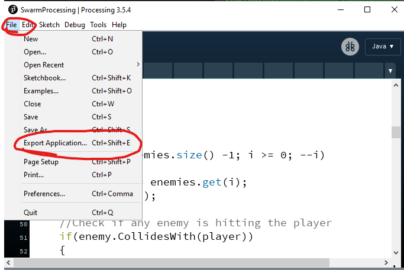
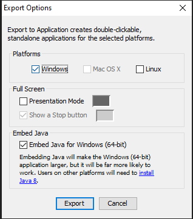
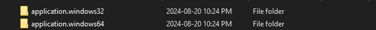
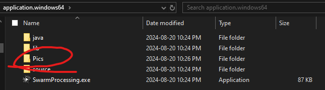

# Processing Builds

A build is a version of the game that removes the raw code leaving only a playable copy of the game.

A build is needed so that other computers can run the game.

## How to build:

1. Press File -> Export Application

2. Select export options. You can only select Mac on mac devices. Presentation mode forces the game into full screen, and you usually do not want that. Finally Embed Java is recommended because without it many devices will not be able to run the applet.

3. Press export and wait for it to complete.

4. Once done, if on windows, you should see two new folders:

usually we want Application 64 as most PCs are 64 bit.

5. Before seeing if it works, copy and paste the pics folder into the application.windows64 and application.windows32 folders

Note: If the folder was named: "data" then you don't need to do this step.

6. Press on the GameName.exe (bottom) to play the game

It's possible to put java applets on websites, ask your instructor for guidance if you'd like to do that.