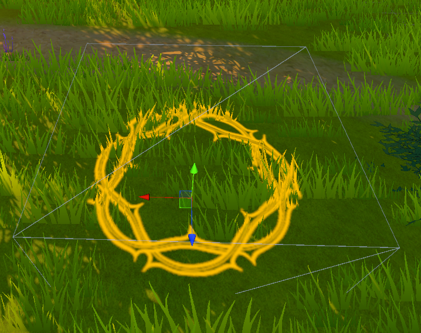
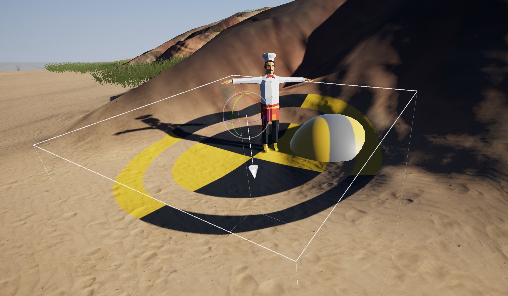

# Decals

Decals are projections from a point onto the scene. They're incredibly useful for making a world feel cohesive and less blocky. That being said, decals are very expensive as they are projected into the scene and should be managed carefully.

Here's a link to read more about decals: https://docs.unity3d.com/Packages/com.unity.render-pipelines.universal@12.0/manual/renderer-feature-decal.html

## Example

Todo... Populate the math

Notice how the image does not clip through the world, but instead is like painting on top of it.

