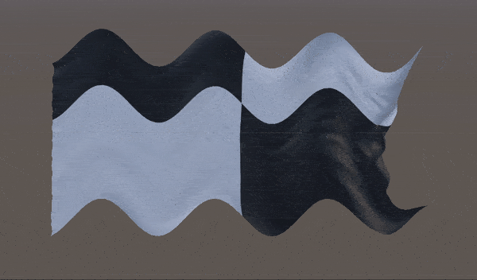
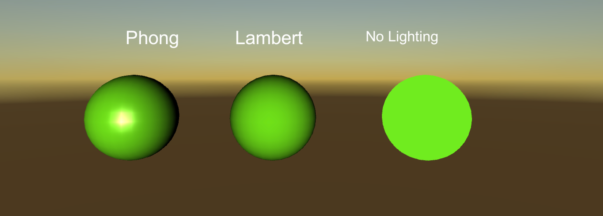

# The Shader Pipeline

The Shader pipeline is how the GPU operates, and is what enables developers to create cool effects, or take load off the CPU.

Because this is the "SparkNotes" version, Here's a link to a different explanation of the 
process: https://www.khronos.org/opengl/wiki/Rendering_Pipeline_Overview

## Components

## Vertex Specification

This is just in the input. Usually the vertex positions, colors, and any other data that needs to be told to the GPU from the CPU.

## [IMPORTANT] [UNITY] Vertex Shader 

The Vertex Shader is one of the most important parts of the render pipeline, as it allows you to manipulate the vertices of the object graphically.

This allows developers to do a variety of effects while expending a fraction of the resources it would have taken to do the same on the CPU.

The downside to the vertex shader is these changes are purely visual. THE MESH IS NOT CHANGING, COLLISION WILL NOT CHANGE.

Here are some examples of vertex shaders, and a Unity Tutorial for making objects rotate without code:

[Unity Move and Rotate shader](https://www.youtube.com/watch?v=J3aeb8IasMk)

## [IMPORTANT] Tessellation

Tessellation is really important, but we usually don't have access to it as game developers. Tessellation allows us to define the Level of Detail (LOD) and the amount of triangles an objects has that's rendering.

## [IMPORTANT] Geometry Shader

The Geometry shader is used to define primitive geometry, and is being phased out for "Mesh Shaders" in DirectX and 
The purpose of this shader is to optimize the topology of the object and reduce the number of vertices and triangles being rendered.

We usually do not have access to the geometry shader.

## Vertex Post-Processing

This is an internal stage that handles optimization and removal of unseen (culled) vertices.

## Primitive Assembly

This stage assembles the scene into primitive shapes such as triangles, squares and lines so the data can be read easily. This stage is also internal

## Rasterization

The Rasterization is the conversion from world space to pixel space on the screen. It determines what actually needs to be rendered, and gives us the "per-pixel" shading in the fragment shader

## [IMPORTANT] [UNITY] Fragment Shader

The Fragment shader is really important because it allows us to achieve graphical effects like Lighting.

The Fragment shader is per-pixel, and executes it's operation on every single pixel it's applied to, making it a vector for lag when used improperly.

The Fragment shader is usually used for colouring the object some examples presented below:

[Unity Glow shader](https://www.youtube.com/watch?v=sjMgaj-nnYo)

