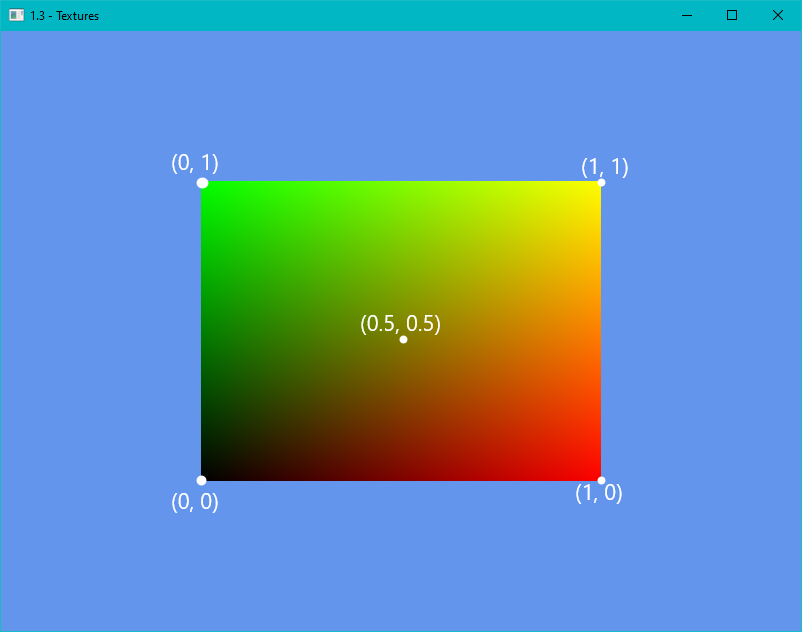
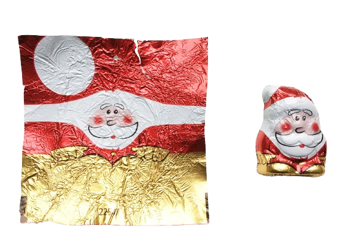
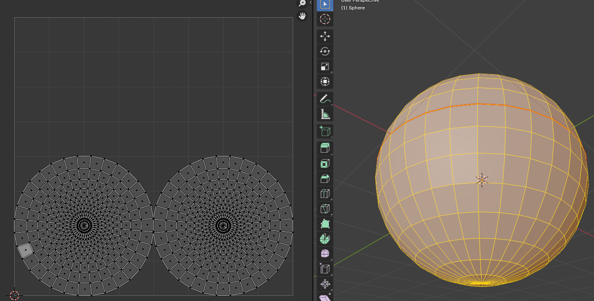
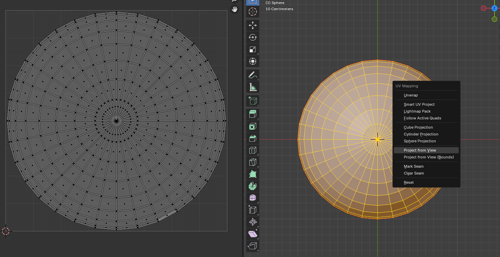
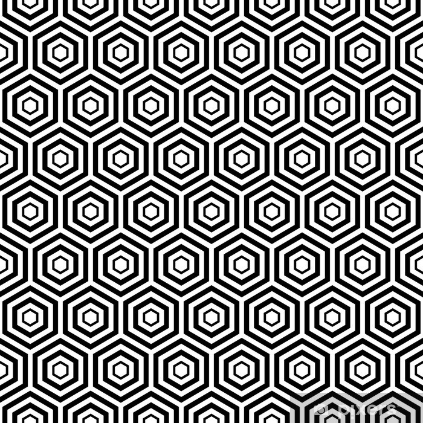
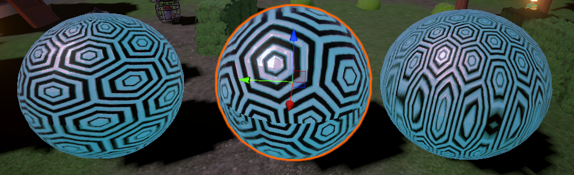

# UVs

UVs are how shaders display objects, represented in 0-1 space, where U is X and V is Y. We represent this in colors (R,G,B) because there are very limited ways of getting information out of the GPU. (1,0) is red because it's (1,0,0). And (0,1) is green is (0,1,0). If UV's had a third dimension, we'd see it in blue.

Every model contains baked data which tells the UVs how to project themselves onto the model, which then allows the developer to change how the model looks based onthe projection.

UVs are "WRAPPED" onto models. The common example for this is wrapping a piece of candy:

## Example

Here are 3 ways to unwrap a sphere, each sphere has the same shader.

There are three main ways to unwrap a sphere in VFX and modelling

### Polar (basic)

### Seams *(Cut in half)

### Projection

To see the effects of these, we apply this texture to each:

Notice how none of them are quite perfect. We need to do a bit more work to obtain a perfect shape due to the nature of a wrap. However, if we're clever with out use of color we can still make interesting effects out of these shapes.

There's a lot more depth to this, but current RP4K is more oriented on coding rather than VFX or art. If you have questions, you can ask your instructor / search for resource online such as Visual Tech Art on Youtube.