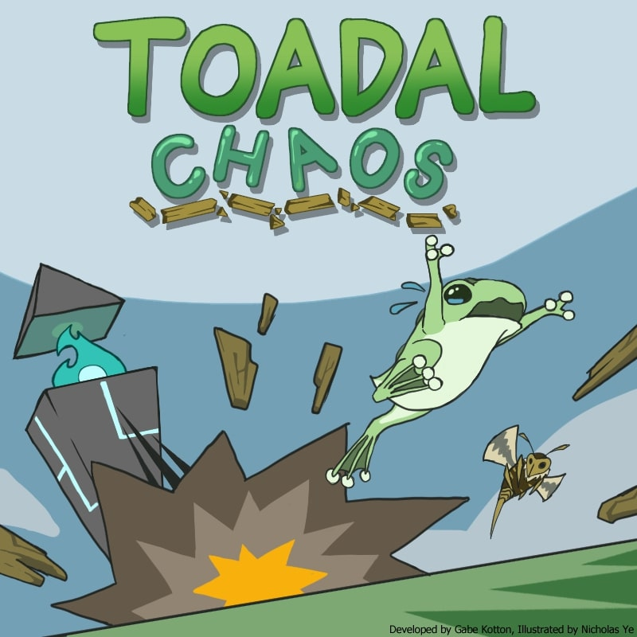

# Toadal Chaos
NOTE: These resources do not contain ALL the content, but mainly the juicy bits of the course. Instructors know more information and will teach it during the course

## Coding
* [Factory.md](../Content/Coding/Factory.md)
* [Object Pooling.md](../Content/Coding/Object%20Pooling.md)

## Essentials
* [Java Symbols](../Content/Essentials/Java%20Symbols.md)
* [Interfaces](../Content/Essentials/Interfaces.md)

## Math
* [Distance.md](../Content/Math/Distance.md)
* [Normalization.md](../Content/Math/Normalization.md)

## Processing
* [Builds.md](../Content/Processing/Builds.md)
* [Core Functions.md](../Content/Processing/Core%20Functions.md)